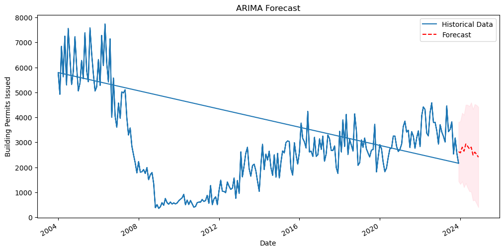

# Building Permits

Welcome to the Building Permits Project README. This project is centered around extracting, transforming, and loading (ETL) building permits data published by the US Census Bureau. With the use of Python and a suite of powerful libraries, this project aims to efficiently manage and analyze building permits data to provide insights into trends and patterns, particularly focusing on autocorrelation analyses to track building momentum across various Core Based Statistical Areas (CBSAs).

## Time Series Analysis

This project focuses on analyzing and forecasting the number of building permits issued in various CBSAs using time series analysis techniques. The core of the analysis is based on ARIMA modeling, a popular method for forecasting time series data that can account for trends, cycles, and seasonality.

### Overview

The analysis pipeline is structured as follows:

1. **Data Retrieval**: We begin by fetching building permits data from a SQLite database. This data is filtered by the specified CBSA to ensure the analysis is region-specific. The retrieved data includes the name of the CBSA, the date of the permit issuance, and the total number of permits issued.

2. **Data Preprocessing**: The data undergoes preprocessing where the date information is converted to a datetime format, and the date column is set as the index of the DataFrame. This step ensures that the time series data is in the correct format for analysis.

3. **Exploratory Data Analysis (EDA)**: Initial exploratory analysis includes plotting the time series data to visualize trends, cycles, and any obvious seasonality. The Autocorrelation Function (ACF) is also plotted to analyze the correlation structure of the data over different lags.

4. **Stationarity Testing**: The Augmented Dickey-Fuller (ADF) test is employed to check the stationarity of the series. A stationary time series is a prerequisite for ARIMA modeling, as it ensures that the properties of the series do not depend on the time at which the series is observed.

5. **ARIMA Modeling**: Based on the EDA and stationarity test results, an ARIMA model is fit to the data. The `p`, `d`, and `q` parameters of the ARIMA model are fine-tuned to achieve the best fit, as indicated by the lowest Akaike Information Criterion (AIC) value. This step involves a grid search over a range of parameter values.

6. **Model Diagnostics**: After identifying the best-fitting ARIMA model, diagnostic plots are generated to evaluate the quality of the fit. These diagnostics include checking the residuals of the model to ensure that they resemble white noise, indicating a good fit.

7. **Forecasting**: The final step involves using the selected ARIMA model to forecast future building permits issuance. The forecast includes not only the predicted values but also the confidence intervals, providing a measure of the uncertainty associated with the forecast.

This project applies time series analysis to predict the future issuance of building permits based on historical data. The ARIMA model, selected through a careful process of parameter tuning and diagnostics, provides a basis for the forecasts. The results offer valuable insights into future trends in building permits issuance, which can aid in planning and decision-making processes in related sectors.



## Extract Transform Load (ETL)

### Project Structure

The ETL subproject is organized into three main components:

- **Extract**: Manages the extraction of building permits data from source files, which range from text files (for data starting in 2004) to Excel files for more recent data.
- **Transform**: Handles the processing and cleaning of the extracted data, preparing it for loading by ensuring data integrity and consistency.
- **Load**: Responsible for loading the cleaned and transformed data into a SQLite database, making it available for analysis and querying.

Additionally, the project incorporates **Alembic** for database migration management, facilitating version control and schema updates for the database.

### Key Technologies

- **Python**: The primary programming language used throughout the ETL processes.
- **SQLAlchemy**: Provides a high-level ORM for database interactions in Python.
- **Marshmallow**: Used for object serialization and deserialization, aiding in the data transformation process.
- **SQLite**: The initial database system used for storing and managing the processed data.
- **Conda**: Acts as the package and environment manager, handling project dependencies.
- **IPython Notebooks**: Utilized for data analysis, including conducting autocorrelation studies to examine building momentum within CBSAs.

### Installation

To set up the project on your local machine, follow these steps:

1. Clone the project repository.
2. Ensure Conda is installed on your system. If not, follow the instructions [here](https://docs.conda.io/projects/conda/en/latest/user-guide/install/index.html).
3. Navigate to the project directory and create a Conda environment using the `environment.yml` file:
 ```bash
conda env create -f environment.yml
```
5. Activate the newly created environment:

```bash
conda activate building_permits_env
```

### Usage

Currently, the ETL processes are executed individually through their respective scripts:

- **Extract**: Run `python extract.py` to start the data extraction process.
- **Transform**: Execute `python transform.py` to transform the extracted data.
- **Load**: Use `python load.py` to load the transformed data into the database.

Data analysis can be performed using the provided IPython notebooks, which include various analyses such as autocorrelation studies of building permit issuances.

### Future Enhancements
- **Airflow Integration**: Implement Apache Airflow to automate the ETL pipeline, enabling the project to run on a monthly schedule and ensure timely data processing and analysis.
- **Refactor**: The `load.py` script is procedural and can be updated to use classes instead.
- **Dockerization**: Containerize the application to streamline deployment and ensure consistency across development environments.
- **Database Upgrade**: Transition from SQLite to PostgreSQL with the PostGIS extension to enhance data handling capabilities and facilitate spatial data analysis. Use Alembic to manage migrations.
- **API Development**: Construct a RESTful API on top of the database to provide programmatic access to the data and analyses.
- **Frontend Development**: Develop a frontend interface with analytics features to offer visual insights into the building permits data, making the data more accessible and interpretable.

### Contributing

Contributions are welcome! Please feel free to fork the repository, make changes, and submit a pull request with your enhancements.

### License

This project is licensed under the MIT License - see the [LICENSE.md](https://github.com/git/git-scm.com/blob/main/MIT-LICENSE.txt) file for details.
